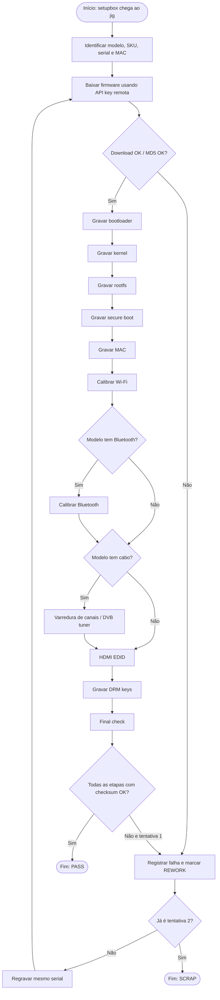

# Relatório de Anomalias de Gravação - Setup Box

## 1. BPMN textual do processo as-is.

## 2. PDD - Process Definition Document

**Objetivo:** monitorar o teste de gravação de setupboxes para detectar falhas sistemáticas, gargalos de cycle time, impacto de downtime, rework e scrap.

**Escopo:** da chegada da unidade ao jig até o resultado final PASS, REWORK ou SCRAP. Inclui download de firmware, gravação de etapas, validação MD5, rework e descarte.

**Entradas:** modelo, SKU, serial, MAC, linha, estação, jig, operador, turno, firmware, API key remota, resultados por etapa, tempos de ciclo e eventos de parada de linha.

**Saídas:** status final por tentativa, defeito, etapa falha, taxa de FPY, yield final, PPM, DPMO, disponibilidade, pareto de defeitos, anomalias por jig/linha/firmware/tempo e relatório auditável.

**Regras de negócio:** se uma tentativa falhar, o mesmo serial pode reaparecer como tentativa 2. Se falhar novamente, vira SCRAP. Bluetooth e cabo só são etapas aplicáveis para modelos que possuem essas funcionalidades.

**Exceções:** falhas de API/remoto, checksum MD5 incorreto, ausência de sinal de cabo, tempo de ciclo atípico, MAC duplicado em seriais diferentes e paradas planejadas ou não planejadas.

**Monitoramento / hiperautomação:** o dashboard pode virar um monitor em tempo real, disparando alerta automático quando um erro ultrapassar limite por linha/jig/firmware ou quando o downtime coincidir com aumento de falhas.

## 3. Achados principais do dataset

| Anomalia | O quê | Onde | Janela | Evidência |
|---|---|---|---|---|
| DRM sistemático | `drm_keys / ERR_DRM` | Linha L4, modelo STB-100, firmware v4.1.0, todos os jigs da L4 | 2022-09-12 06:05 até 23:05, aprox. 17h | 599 falhas; maior defeito do Pareto |
| Jig crônico | `rootfs / ERR_MD5` | Jig JIG-L3-ST2-2, linha L3, firmware v4.1.2 | 2022-09-12 06:03 até 2022-09-14 22:57, aprox. 64,9h | 561 falhas; taxa de falha de rootfs acima de 54% no jig |
| Acesso remoto/API | `fw_download / ERR_AUTH` | Linha L2, todos os jigs, firmware v4.1.2 | 2022-09-13 09:00 até 10:29, aprox. 1,47h | 178 falhas; coincide com parada “Remote recording auth/firmware server unavailable” |
| Cabo sem sinal | `cable_scan / ERR_NO_SIGNAL` | Linha L4, modelos com cabo, firmware v4.1.2 | 2022-09-14 11:03 até 12:39, aprox. 1,61h | 58 falhas; coincide com parada “Cable head-end signal loss” |
| Cycle time alto | `wifi_cal_cycle_s` | Picos em testes de Wi-Fi | Varia por tentativa | Mediana ~30,1s, P99 ~68,1s, máximo 193,8s |
| Integridade | MAC repetido em seriais diferentes | 6 MACs problemáticos | Durante o período todo | Um MAC aparece associado a 45 seriais diferentes |

## 4. Métricas globais

- Tentativas: 17.844
- Seriais únicos: 16.115
- FPY: 89,27%
- Yield final: 96,48%
- PPM: 107.291
- Disposition: 15.548 PASS, 1.729 REWORK, 567 SCRAP

## 5. Como reproduzir no dashboard

Use os filtros da barra lateral para selecionar linha, estação, jig, modelo, firmware, turno, erro, disposition e intervalo de data. Para cada achado, filtre pelos campos citados na tabela e confira as abas: KPIs, Pareto, Jig x Etapa, Falhas no Tempo, Cycle Time, Yield e Auditoria.
